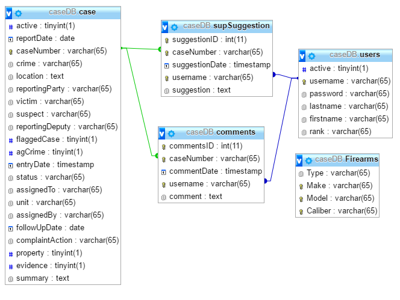
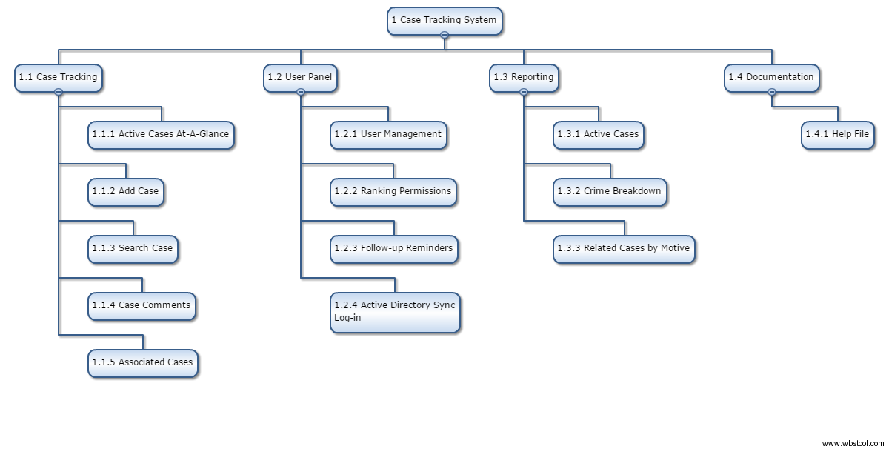

**Case Tracking Database Capstone Proposal**

by

Ernesto Louie Cortez & Brian Rono

Senior Capstone

Spring 2017

  

**CALIFORNIA STATE UNIVERSITY MONTEREY BAY**

**SEASIDE, CALIFORNIA**

**Case Tracking Database Capstone Proposal**

Submitted in partial fulfillment of Senior Capstone requirements.

Author:	_________________________________________________

Ernesto Louie Cortez; B.S., CSU Monterey Bay, 2017

Author:	_________________________________________________

Brian Rono; B.S., CSU Monterey Bay, 2017

Stakeholder:	_________________________________________________

Matt Luther; Commander Monterey County Sheriff’s Office**TABLE OF CONTENTS**

[[TOC]]

[[TOC]]

**EXECUTIVE SUMMARY**

We have been given the opportunity to develop a tracking and analytical database for the Monterey County Sheriff’s Office (MCSO) case tracking system.  The primary deliverables requested of the database are the organization of MCSO Detectives’ active and archived cases, journaling and collaboration between Detectives and Supervisors, and the ability to generate reports based on trends and statistics. This proposal starts with an outline of the Sheriff’s Office perspective and highlights their problem with requested solution.  Following after is our proposed product and development plan.

 

**ACKNOWLEDGMENTS**

In developing the ideas and foundational knowledge in web development with database planning and implementation for this project, we would like to thank Jason Henderson and Dr. Glenn Bruns, CSU Monterey Bay. For assistance in project and time management skills necessary to keep this project’s deliverables timely, we would like to acknowledge Dr. Eric Tao, CSU Monterey Bay.

# I Chapter One - Client Requests and Commitments

## 1.0 Introduction 

### 1.0.1 The Client

The mission of the Monterey County Sheriff’s Office is to safeguard the lives and property of the people within the county. The MCSO performs law enforcement and custody duties with honor and integrity in order to guard the public trust. Their highly trained and competent workforce reflects the diversity of the community and demonstrates the highest standards of professionalism.

	The Investigation Unit’s primary function is the investigation of major felony criminal cases, as well as cases that may be particularly complex or sensitive. Investigations also provides general and specialized support to other law enforcement agencies within the county. Commander Matt Luther oversees this Division and will the the primary point of contact in the organization for feedback on the product.

### 1.0.2 Problem Description

The Investigations Unit used a Microsoft Access Database to keep track of active cases being worked on by detectives. Over time, the Unit’s needs grew but they were unable to retrofit the Access Database to fit those needs.  This forced detectives to journal case progress on paper, slowing down the collaborative process between detectives and other agencies.

Commander Luther requires a method of keeping track of his Detectives’ active and archived cases, journaling and collaboration between Detectives and Supervisors, and the ability to generate reports based on trends and statistics.  

### 1.0.3 Requested Solution

	Creation of a Case Tracking System would benefit the department immensely. The system should have the ability to keep track of all investigations, as well as create reports, associate similar cases, and allow communication on cases. This would allow the division to work more efficiently and effectively while handling ongoing investigations.

## 1.1 Stakeholder Commitments

### 1.1.1 Primary Stakeholder

	Commander Luther of the Investigations Unit will be the customer, primary stakeholder, and point of contact for the project requirements, deadlines, and criticism.  The commander has agreed to weekly checkins for progress updates and feedback, as well as access to facilities and network infrastructure to those team members that have passed background check.

### 1.1.2 Subject Matter Experts

	Sergeant Hoskins of the Investigations Unit will be our Subject Matter Expert for discovering the needs and processes of the Investigations Unit, ensuring the product functions in-line with department expectations of functionality.

	Departmental Information Systems Coordinators Weber and Greene will be the team’s Subject Matter Experts for security and technical requirements within the Monterey County Sheriff’s Office infrastructure and respective governmental policies.

## 1.2 Requested Deliverables

### 	1.2.1 Stakeholder Requirements

* Detectives will be able to keep track of assigned cases, journal progress, and receive feedback from Supervisors.

* Supervisors and Commanders will be able to monitor progress of all cases and leave feedback for detectives.

* Supervisors and Commanders will be able to generate reports based on desired attributes for reporting and for performance review.

### **1.**2**.**2** Functional Requirements**

* Other authorized users will have read-only access for reporting reasons.

* The program will make use of Microsoft Active Directory syncing.  Therefore, detectives will only need to know their domain username and password.

* The program will be hosted on their local intranet to ensure secure access to the database.

* The user interface must be easy for MCSO employees to understand and help documentation should be present

### 1.2.3 Stretch Functionality

* System generated suggestions for related cases based on weapon or motive

* System generated map of related cases based on location and suspect

# II Chapter Two - Proposed Solution

## 2.0 Solution

After reviewing the MCSO’s request, our team’s proposed solution is to create a web application front-end with a MySQL database to store the information. This allows for the flexibility of adding features and functionality down the road. 

## 2.1 Development & Deployment

### 2.1.1 Overview

	This project will follow an Agile Software Development methodology to ensure timeliness of deliverables and collaboration between team members, stakeholders, and subject matter experts.  PivotalTracker.com will be used to keep track of version contol history commits, user stories, and velocity.

	The tracking system will be deployed on a physical server within the Monterey County Sheriff’s Office intranet.  Hosting and development will be done with LAMP (Apache, PHP, MySQL on Linux) web development environment.  For security and user permissions, active directory syncing will be employed so that detectives can log in with their MCSO domain credentials.

### 2.1.2 Database

MySQL will be used as the relational database management system for storing and analyzing the various data entered by the detectives.  Illustrated below is the planned relational schema and attributes of the database.

### 2.1.3 User Interface Front-End

	Creating a web-based solution allows us to be flexible with programming and features.  For the development of the web-based front end, the project will employ the server-side scripting language PHP.  Illustrated below is a Work Breakdown Structure to provide core visualization of the product features. 

## 2.2 Development Team

### 2.2.1 Overview

Ernesto Cortez and Brian Rono are Computer Science majors with concentration in Software Engineering.  Their projected graduation date is Spring 2017.  Brian’s role on the team will be as Project Manager and Developer.  Ernesto’s role will be that of Technical Writer, Quality Assurance and Developer.

### 2.2.2 Additional Members and Majors

At this time we are requesting one additional member to complete the project in a timely manner.  For this project, a Data Science major will be desired for database design and data analysis.

## 2.3 Resources

### 2.3.1 Labor Hours

Through interviews with various Computer Science instructors, it is our estimate that this project will require 600 hours of commitment to complete basic functionality and requirements.  1000 hours of commitment will be required to complete all requirements, including stretch goals.

### 2.3.2 Advisor Commitment

	The Team requests one professor from CSU Monterey Bay’s School of Computing and Design to serve as an advisor.  The advisor must commit to 1-2 meetings per week to support the team in subject matter and technical advisement.  For his experience with internet programming and database design, the team would request the service of Lecturer Jason Henderson.

# III Chapter Three - Conclusion

## 3.0 In Summary

	In terms of complexity, this project will utilize multiple technologies and skillsets under the computer science umbrella.  Some of the skillsets required will be database design, software engineering, web development, and network administration and security.  The technologies required for the execution of the product include PHP, MySQL, Apache, HTML, Javascript, and Jquery. 

The mission of the Monterey County Sheriff’s Office is to safeguard the lives of the people in the county, this project's ability to increase efficiency of the investigations process will help all surrounding communities. This is achieved by allowing more collaboration between detectives, as well as reducing or eliminating the need for paper forms. This will also allow for reports to be generated which may increase the future budget allocation of the department.

Above all, the project cannot be completed alone and will require the collaboration of a diverse group of software developers with complementary skillsets. Every student at CSU Monterey Bay must complete a capstone to demonstrate knowledge, skills, and abilities developed over the course of our learning experience.  It is our team’s belief that this project will demonstrate those requirements due to its complexity, social impact, and necessitation of teamwork. 

